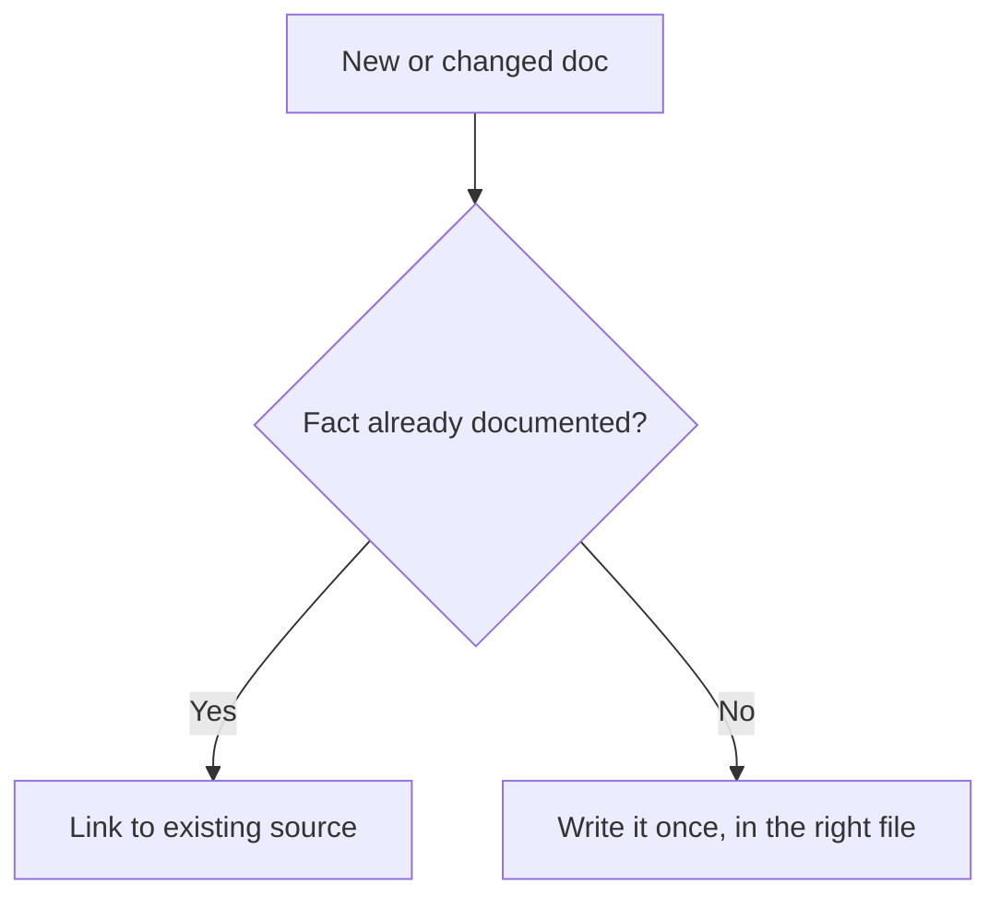

# Documentation

Write documentation that stays correct as the code evolves. Three constraints keep docs from rotting.

## No Duplication

Every fact lives in exactly one place. If it exists elsewhere, link to it — never copy it.

```markdown
<!-- BAD: inline copy of a fact owned by another doc -->
The sync command accepts --platform reverb|ebay|all.

<!-- GOOD: link to the single source of truth -->
See the [sync command](./README.md#sync--search-marketplaces-and-sync-into-odoo).
```

## No File Listings

Do not paste `ls`/`tree` output. Describe purpose instead — readers can browse the repo themselves.

````markdown
<!-- BAD: directory dump that rots the moment a file is added -->
```
src/
├── sync_model.py
├── reverb_scraper.py
└── ebay_scraper.py
```

<!-- GOOD: describe what the directory is for -->
The root contains the CLI entry points and scrapers. Each scraper has a matching test file in `tests/`.
````

## No Config Content Dumps

Do not paste YAML/TOML/INI keys verbatim. Link to the file and explain the *decision* behind the config.

````markdown
<!-- BAD: pasted config that drifts from reality -->
```yaml
timeout: 30
retries: 3
```

<!-- GOOD: link + reasoning -->
Timeout and retry policy live in [`pyproject.toml`](../pyproject.toml). The 30 s timeout matches the Reverb API's documented SLA.
````

## Write Why, Not What

Code shows *what*. Docs explain *why* — the constraint, trade-off, or decision a reader cannot infer from reading the code.

```markdown
<!-- BAD: restates the code -->
`_search_ebay` searches EBAY_US and EBAY_CA in parallel and deduplicates results.

<!-- GOOD: explains the constraint -->
We search both EBAY_US (filtered to ships-to-CA) and EBAY_CA because a Canadian seller
listing on EBAY_CA will not appear in EBAY_US results even with `deliveryCountry:CA`.
```

## Diagrams

Use [Mermaid](https://mermaid.js.org/) in fenced ` ```mermaid ` blocks. Diagrams are source code — version-control them, never paste exported PNGs.

````markdown

````

## Pre-Commit Checklist

Before opening a docs PR, verify:

- No broken fenced code blocks (every ` ``` ` opener has a matching closer)
- Every file referenced by relative link exists on disk
- No placeholder text like `TODO` or `XXX` left in copy-pasted snippets
- CLI examples use `uv run reverb2odoo` (not bare `reverb2odoo` or `python`)
- Relative links resolve from both GitHub and local checkout
